# 机器学习如何做因果推断？——一篇经济学综述的通俗解读

> **原文**：Anthony Strittmatter, *Machine learning for causal inference in economics*, IZA World of Labor 516 (April 2025). DOI: 10.15185/izawol.516
> **原文链接**：<https://wol.iza.org/articles/machine-learning-for-causal-inference-in-economics/long>
> **本文性质**：中文解读 + 图解。原文的图与关键版块以截图形式保留（标注"原文"），其余图表为本文作者为帮助理解而制作（均已标注"示意图/作者绘制"），请勿与论文原始结果混淆。

---

## 目录

- [一、这篇文章到底在说什么](#一这篇文章到底在说什么)
- [二、论文信息卡与核心观点](#二论文信息卡与核心观点)
- [三、一张图看懂全文结构](#三一张图看懂全文结构)
- [四、打地基：机器学习的三个基本功](#四打地基机器学习的三个基本功)
- [五、因果机器学习要解决的两个问题](#五因果机器学习要解决的两个问题)
- [六、主力工具之一：双重机器学习（Double ML）](#六主力工具之一双重机器学习double-ml)
- [七、主力工具之二：因果森林（Causal Forest）](#七主力工具之二因果森林causal-forest)
- [八、四条红线：论文最想让你记住的警告](#八四条红线论文最想让你记住的警告)
- [九、论文自陈的局限](#九论文自陈的局限)
- [十、政策建议与作者主旨](#十政策建议与作者主旨)
- [十一、给研究者的实操清单](#十一给研究者的实操清单)
- [十二、常见误解 Q&A](#十二常见误解-qa)
- [十三、参考文献](#十三参考文献)

---

## 一、这篇文章到底在说什么

用一句话概括：**机器学习本来是用来"猜得准"的，这篇文章讲的是怎么把它改造成"说得清因果"的工具，以及改造过程中有哪些坑千万不能踩。**

传统计量经济学做政策评估时，研究者要自己拍板一大堆事情：放哪些控制变量？要不要加平方项？要不要加交互项？按什么变量分组看异质性？这些"拍板"既费力，又容易在事后被质疑是"挑出来的结果"。

机器学习的长处恰恰在这里：它能在**成百上千个候选变量**里自动筛选，能自动捕捉**非线性和交互**，还有一套**交叉验证**机制专门防止"过度拟合"。但机器学习的目标函数是"预测误差最小"，而不是"因果效应无偏"——直接拿来做因果推断会翻车。

于是就有了**因果机器学习（Causal ML）**：保留机器学习的灵活性，但在关键位置重新设计目标函数和推断程序，让最终的估计量重新具备"一致、渐近正态、可以算标准误、可以做检验"的计量性质。

论文用一张图说明了为什么现在讲这个话题——过去十年，用"因果机器学习"关键词的经济学论文数量从接近零涨到了每年一百多篇：

**图0（原文配图）：使用因果机器学习方法的经济学论文数量趋势**

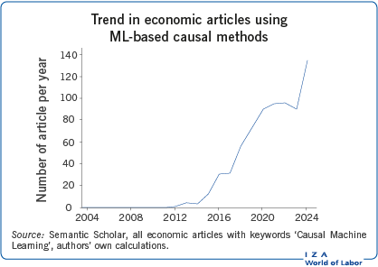

> 原文图注：*Source: Semantic Scholar, all economic articles with keywords 'Causal Machine Learning', authors' own calculations.*
> 通俗解读：2012 年之前基本是零，2016 年后开始起飞，2024 年逼近每年 140 篇。这是一个还在陡峭上升期的领域。

---

## 二、论文信息卡与核心观点

### 表1　论文信息卡

| 项目 | 内容 |
|---|---|
| 标题 | Machine learning for causal inference in economics |
| 作者 | Anthony Strittmatter（UniDistance Suisse，瑞士） |
| 发表 | IZA World of Labor，文章编号 516，2025 年 4 月，第 1 版 |
| DOI | 10.15185/izawol.516 |
| 文章类型 | 政策导向的综述（非原创实证），面向政策制定者与应用研究者 |
| 关键词 | big data、causal AI、causal inference、double machine learning、machine learning、policy analysis |
| 覆盖方法 | Lasso、决策树、随机森林、神经网络；Double ML、因果森林 |
| 明确不覆盖 | 支持向量机、矩阵补全（matrix completion）、因果发现（causal discovery） |
| 核心案例 | 明瑟工资方程、定居者死亡率（AJR 2001）、康涅狄格 Jobs First 福利实验、肯尼亚现金转移、房价预测、PSID 性别工资差距 |

### 原文的"电梯演讲"（Elevator pitch）


> **中文大意**：机器学习通过应对现代数据的复杂性来改进经济政策分析。它是对传统计量方法的补充——能处理大量控制变量、灵活处理交互与非线性、系统性地揭示细致的异质性因果效应。但要给出可靠的政策建议，必须谨慎验证，并清醒意识到它在偏误风险、透明度和数据需求方面的局限。

### 原文的"关键发现"（Key findings）

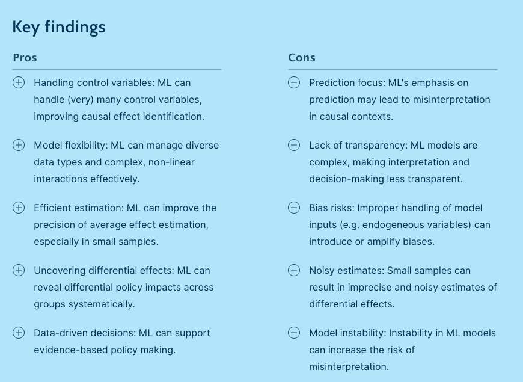

### 表2　原文 Pros / Cons 的中文对照与解读

| | 原文要点 | 通俗解读 |
|---|---|---|
| **优点 1** | Handling control variables：能处理（非常）多的控制变量 | 变量比样本还多也能跑，传统 OLS 直接死机 |
| **优点 2** | Model flexibility：能处理多样的数据类型和复杂的非线性交互 | 不用你手动想"要不要加交互项"，也能吃文本、图像 |
| **优点 3** | Efficient estimation：能提高平均效应估计的精度，小样本尤其明显 | 该控的才控，不该控的不控 → 方差更小、置信区间更窄 |
| **优点 4** | Uncovering differential effects：能系统性揭示不同群体的效应差异 | 从"平均有效"走向"对谁有效、对谁无效甚至有害" |
| **优点 5** | Data-driven decisions：支撑循证决策 | 减少"研究者自由裁量"带来的可信度质疑 |
| **缺点 1** | Prediction focus：以预测为导向，容易在因果场景被误读 | 预测得准 ≠ 找到了因果机制 |
| **缺点 2** | Lack of transparency：模型复杂，可解释性差 | 黑箱结论在政策场合难以向公众和决策者交代 |
| **缺点 3** | Bias risks：模型输入处理不当（如放入内生变量）会引入或放大偏误 | Double ML 对"对撞变量"特别敏感 |
| **缺点 4** | Noisy estimates：小样本下异质性估计噪声大 | 切得越细，标准误越大，容易什么都测不显著 |
| **缺点 5** | Model instability：模型不稳定增加误读风险 | 同一份数据换个子样本，选中的变量就换了一批 |

---

## 三、一张图看懂全文结构

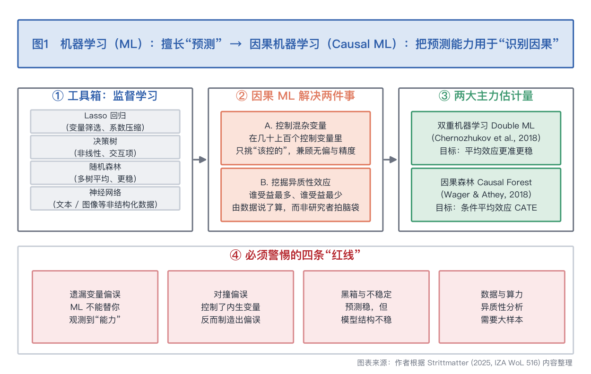

这张图把全文压缩成四块：

1. **工具箱**——四种监督学习方法，它们本身只是"预测器"；
2. **两大任务**——因果 ML 用这些预测器去做两件事：控混杂、挖异质性；
3. **两大主力估计量**——Double ML 管平均效应，因果森林管异质性效应；
4. **四条红线**——论文花了大量篇幅讲的限制条件。

下面按这个顺序展开。

---

## 四、打地基：机器学习的三个基本功

### 4.1 过拟合：像"背答案的学生"

论文用了一个很好的比喻：**过拟合就像一个把模拟卷答案全背下来的学生，真考试稍微换个问法就傻眼了。**

模型如果太贴合训练数据，学到的就不是规律，而是这批数据里的**噪声**。一个能完美复现历史股价的模型，往往对未来一无所知。

问题的另一面是：模型太简单也不行，会漏掉真实存在的规律。这就是**偏差—方差权衡**：

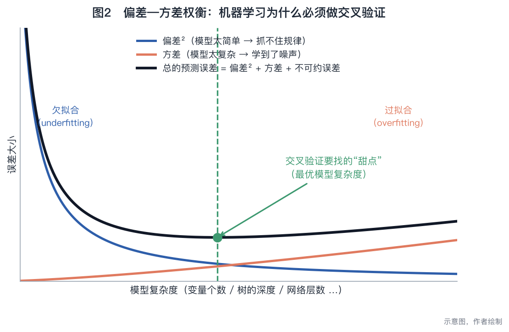

- 往左走（模型太简单）：**偏差**大，系统性地估错；
- 往右走（模型太复杂）：**方差**大，换一批数据结果就变；
- 总误差是一条 U 型曲线，我们要找的是那个谷底。

论文特别强调了一点值得注意：**传统计量方法通常没有系统性地处理过拟合问题**，而机器学习把这件事做成了标准流程。

### 4.2 交叉验证：机器学习的"防作弊墙"

怎么找那个谷底？答案是**交叉验证**——把数据切成 k 份，轮流拿一份当"考卷"、其余当"课本"。

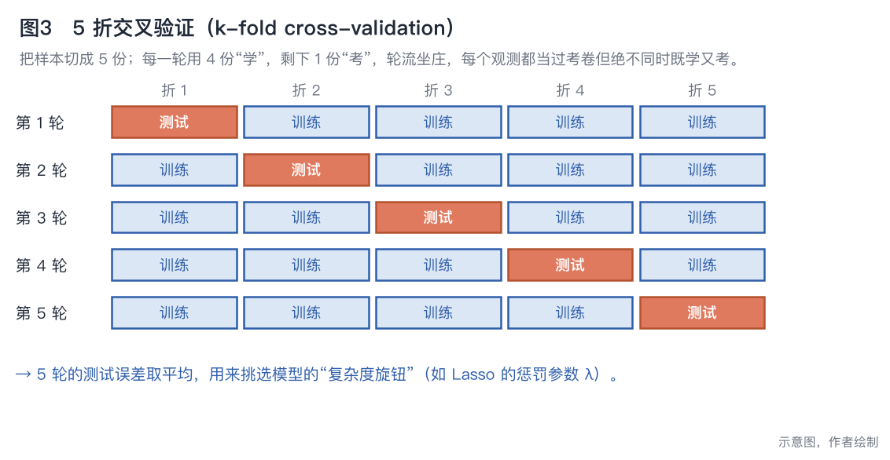

论文用了一个很形象的词：训练样本和测试样本之间要有一道 **firewall（防火墙）**。每个观测都会当过考卷，但**永远不会同时既当课本又当考卷**。

### 4.3 四种监督学习方法

论文介绍的都是**监督学习**（supervised ML）——输入和输出都能观测到，目标是把输出预测准。这是后面所有因果方法的零件。

其中 **Lasso** 最值得单独看一眼，因为它是 Double ML 里最常用的"零件"。Lasso 在普通回归的损失函数上加了一个惩罚项，效果是把系数往零压缩，弱变量直接被压成 0——相当于**边估计边选变量**：

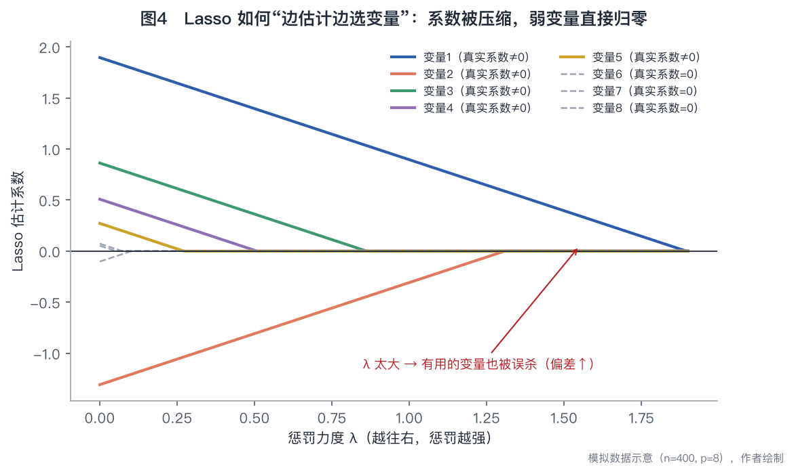

惩罚力度 λ 是个旋钮：λ=0 就是普通 OLS，λ 越大留下的变量越少。旋到哪个位置？——**交叉验证说了算**。

论文也点出了 Lasso 的适用边界：它在**稀疏模型**（真正有用的变量只有少数几个）里表现最好；如果几十个变量都同等重要，Lasso 的预测表现反而会下降。

### 表3　四种监督学习方法对比（据论文内容整理）

| 方法 | 一句话原理 | 擅长什么 | 短板 | 论文举的例子 |
|---|---|---|---|---|
| **Lasso 回归** | 加惩罚项，把弱变量的系数压成 0 | 高维数据（变量比样本还多）；稀疏结构 | 变量都同等重要时效果差；**选变量结果不稳定** | 预测工资时保留教育、经验，剔除"公司福利"这类弱变量 |
| **决策树** | 按变量取值反复切分样本，叶子里取均值作预测 | 非线性、交互效应；直观易讲 | 对数据的微小变化非常敏感，树的结构不稳 | 用收入、信用分、负债收入比给借款人分风险档 |
| **随机森林** | 训练成千上万棵树再平均（Bagging） | 精度和稳定性都优于单棵树 | 可解释性差——上千棵树怎么解释？ | 用年龄、病史、基因标记预测疾病风险 |
| **神经网络** | 多层神经元 + 非线性激活函数 | 极复杂的非线性；文本、图像等非结构化数据 | 要大数据、要算力、要专门的编程能力；彻底的黑箱 | ChatGPT 这类大语言模型的底层架构 |

### 表4　机器学习的三大流派（论文背景知识框）

| 流派 | 干什么 | 常见方法 | 经济学中的应用 |
|---|---|---|---|
| **监督学习** | 已知输入和输出，学一个预测/分类规则 | Lasso、决策树、神经网络 | 用社交媒体情绪 + 市场基本面预测股价 |
| **无监督学习** | 只有输入，找数据中的结构和模式 | 聚类、主成分分析 | 客户分群、金融交易异常检测、政策干预的目标群体划分 |
| **强化学习** | 序贯决策：行动→拿到反馈→改进策略 | 探索与利用的平衡 | 动态定价、重复拍卖中的竞价策略 |

> 因果机器学习主要建立在**监督学习**之上。

---

## 五、因果机器学习要解决的两个问题

论文把因果 ML 的价值明确归结为两件事：

### 问题 A：把该控的混杂变量控住（而且只控该控的）

**混杂变量**是那些同时影响"处理"和"结果"的变量。经典例子：估计教育对工资的回报时，"能力"同时决定了一个人读多少书、也决定了他挣多少钱。不控制它，教育的回报就会被高估。

传统做法的两难：
- 控得太少 → **遗漏变量偏误**（有偏）；
- 把能想到的全都塞进去 → 变量一多就**过拟合**，标准误爆炸（无偏但没用）。

因果 ML 的承诺是：**在庞大的候选池里自动识别出"真正相关"的那些混杂变量**，在偏误和精度之间找到平衡。

论文特别提醒：这个需求**不只存在于回归和匹配**。工具变量（IV）法中，工具的有效性常常需要"在控制某些变量之后"才成立；双重差分（DiD）中，平行趋势假设也常常是"条件平行趋势"。因果 ML 对这三类设计都适用。

### 问题 B：系统性地挖掘异质性效应

**"平均有效"是一个很粗的结论。** 政策制定者真正想知道的是：谁受益最多？谁没受益？有没有人反而受损？

传统做法是研究者自己选几个维度分组（按性别、按年龄、按学历），风险有二：
1. 你没想到的那个维度，就永远发现不了；
2. 分组分得越细，越容易过拟合，标准误越大，越难测出显著。

因果 ML 的做法是让**数据来告诉你该按什么切**。

### 表5　传统计量方法 vs 因果机器学习（据论文观点整理）

| 维度 | 传统计量方法 | 因果机器学习 |
|---|---|---|
| 控制变量的选择 | 研究者判断 + 理论指导 | 数据驱动的筛选准则（如 Lasso 惩罚） |
| 函数形式 | 手动设定（是否加平方项、交互项） | 由算法灵活拟合 |
| 变量维度 | 变量数必须远小于样本量 | 可以处理 p > n |
| 过拟合 | 通常不系统处理 | 交叉验证 / 交叉拟合是标配 |
| 异质性分析 | 事先指定分组维度 | 由算法搜索最能区分效应的切分 |
| 透明度 | 高，系数可直接解读 | 低，模型是黑箱 |
| 识别假设 | 必须成立 | **同样必须成立，一个也不能少** |

> 最后一行是论文反复强调的：**因果 ML 改善的是"估计"，不是"识别"。**

---

## 六、主力工具之一：双重机器学习（Double ML）

### 6.1 从明瑟方程说起

论文的引子是劳动经济学最经典的**明瑟工资方程**：工资 = f（受教育年限, 工作经验, 任职年限）+ 误差项。

现实中的关系当然更复杂：经验和任职年限可能有交互作用，它们的效应还可能随水平变化而变化（非线性）。于是问题来了：

- 漏掉了重要的交互项或非线性项 → **模型设定错误导致有偏**；
- 把所有可能的项都加进去（尤其在小样本里）→ **过拟合**。

又是那个偏差—方差权衡。Double ML 就是为了在这个权衡里找平衡点。

### 6.2 Double ML 的四步流水线

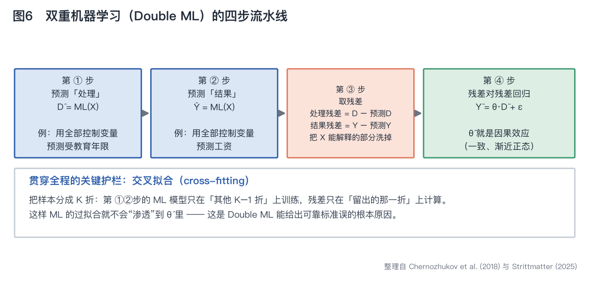

### 表6　Double ML 四步详解

| 步骤 | 做什么 | 直觉 |
|---|---|---|
| ① 预测处理变量 | 用监督学习，以全部控制变量 X 预测处理 D | "在这些人的背景条件下，本来该读多少年书？" |
| ② 预测结果变量 | 用监督学习，以全部控制变量 X 预测结果 Y | "在这些人的背景条件下，本来该挣多少钱？" |
| ③ 取残差 | 处理残差 = D − 预测D；结果残差 = Y − 预测Y | 把 X 能解释的部分全部"洗掉"，只留下"意料之外"的部分 |
| ④ 残差对残差回归 | 把结果残差对处理残差回归，斜率即因果效应 θ | 剩下的关联，已经和 X 无关了 |

**为什么这样做有效？** 直觉是：如果两个人背景条件完全相同，但其中一个"意外地"多读了两年书，那么他"意外地"多挣的钱，就更可能是教育本身带来的。

下面这张图用模拟数据展示了这个过程——同一份数据，直接回归会把真实效应 1.0 高估到 2.41，残差化之后回到 0.98：

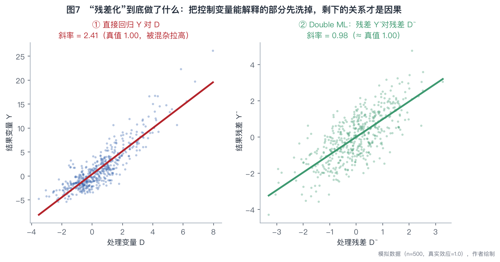

### 6.3 关键护栏：交叉拟合（cross-fitting）

这是 Double ML 名字里那个"double"背后最重要的技术细节。

问题在于：第①②步用的机器学习模型很容易过拟合，如果在同一批数据上又训练模型又算残差，过拟合会"渗透"进最终的 θ 估计里，标准误就不可信了。

**交叉拟合**的解法和交叉验证同构：把样本分成 K 折，ML 模型只在"其他 K−1 折"上训练，残差只在"留出的那一折"上计算，轮流一遍。这样残差就不受训练数据影响。

有了它，Double ML 才具备论文所说的性质：**一致（consistent）、渐近正态（asymptotically normal）**，因而可以做常规的假设检验。

### 6.4 案例：定居者死亡率（AJR 2001）

这是论文里最能说明"精度价值"的案例。

- **原始研究**：Acemoglu、Johnson、Robinson（2024 年诺贝尔经济学奖得主）用**定居者死亡率**作为工具变量，研究制度对经济产出的影响，样本只有 **64 个国家**。
- **难点**：制度好 → 收入高，但收入高 → 制度更好，存在反向因果。IV 的逻辑是：早期殖民者死亡率低的地方，更容易建立长期的良好制度。
- **新问题**：地理因素（比如离赤道的距离）可能同时影响定居者死亡率和经济产出，成为**工具变量的混杂因子**。后续研究（Belloni et al., 2014）指出应该控制 **16 个**潜在的工具变量混杂因子。
- **传统做法的困境**：64 个观测值配 16 个控制变量，方差飙升、精度崩溃，结果变得**统计上不显著**。
- **Double ML 的做法**：用 Lasso 只保留真正相关的混杂因子。结果**与原始研究一致，但置信区间明显更窄**。

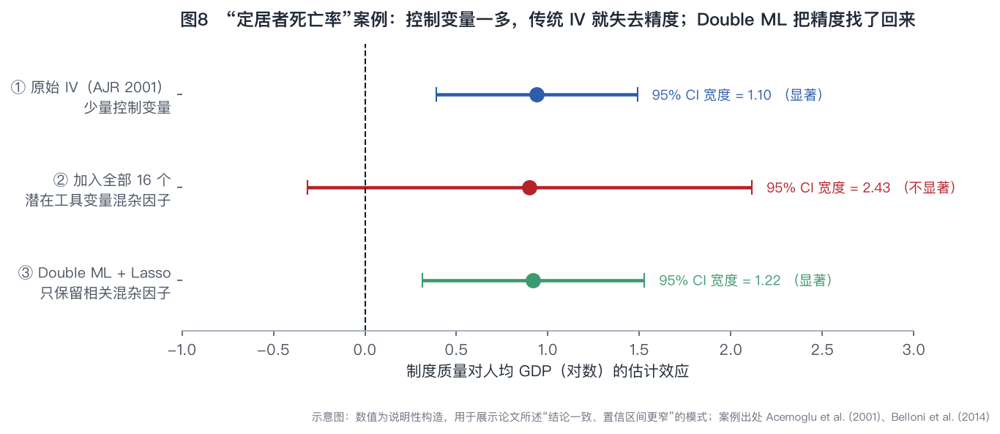

> ⚠️ 上图为**示意图**，用于展示论文描述的"结论一致、置信区间更窄"这一模式，具体数值为说明性构造，不是三项研究的原始估计值。

**这个案例的启示**：因果 ML 的价值不一定是"改变结论"，很多时候是**在同样的结论上给出更可信的精度**——而在小样本研究里，精度往往就是生死线。

---

## 七、主力工具之二：因果森林（Causal Forest）

### 7.1 换一个目标函数，预测工具就变成因果工具

因果森林建立在随机森林之上，但**目标函数完全不同**：

- 决策树问的是：怎么切，能让 **Y 的预测误差**最小？
- 因果树问的是：怎么切，能让**两边子样本的处理效应差异**最大？

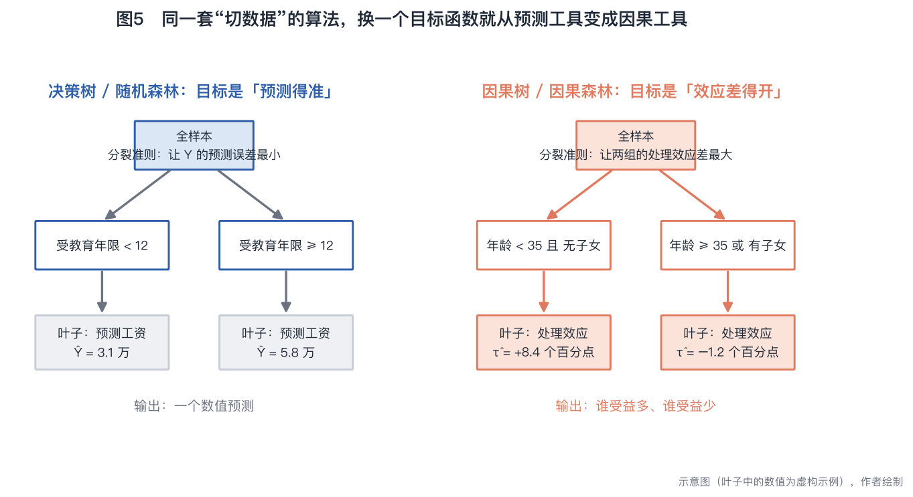

一棵因果树把样本切进不同的"叶子"，每个叶子报告一个处理效应；把成千上万棵这样的树平均起来，就是**因果森林**，它能对每一个个体给出一个估计的效应 τ̂(x)，即**条件平均处理效应（CATE）**。

论文明确指出：因果森林同样是**一致且渐近正态**的，标准误可以用**无穷小 Jackknife**（Infinitesimal Jackknife）这类重抽样方法估计。这一点很关键——它意味着因果森林不只是"探索性工具"，而是可以做正式统计推断的估计量。

### 7.2 为什么"只看平均值"会误导

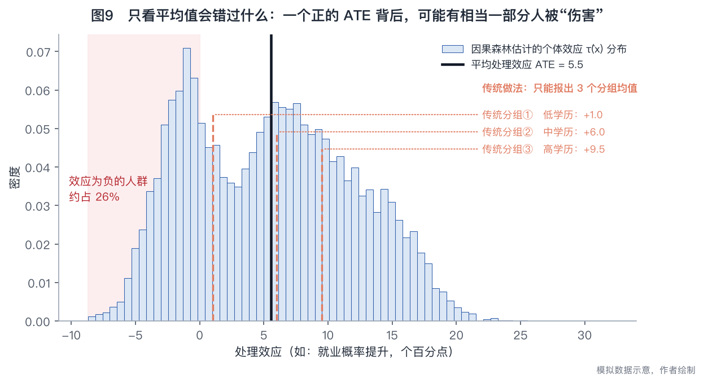

上图的模拟情形很典型：整体 ATE 是正的（+5.5），但个体效应分布很宽，有相当一部分人的效应是**负的**。传统的"按学历分三组"只能报出 3 个均值，完全看不到这个分布。

### 7.3 案例一：康涅狄格州 Jobs First 福利实验

- **背景**：这项福利实验同时包含**正向和负向的工作激励**，是检验劳动供给理论的天然试验场。
- **传统方法的结论**：无法验证理论预测（Bitler、Gelbach、Hoynes, 2017）——论文认为原因很可能是传统方法**捕捉效应异质性的能力有限**。
- **因果森林的结论**：Strittmatter（2023）用**同一份数据**，发现了**多得多的异质性**，结果**支持了劳动供给理论的预测**，并在细粒度上刻画出不同子群体的反应差异，进而指出福利项目可以从哪些方面改进工作激励。

> 这个案例的分量在于：**同样的数据、同样的实验，换一套估计方法就把"理论不成立"改写成了"理论成立"**。方法本身可以是发现。

### 7.4 案例二：肯尼亚的反贫困现金转移

慈善和援助领域一个非常现实的问题：**钱应该给最穷的人，还是给那些稍微好一点、但更能把钱用出效果的人？**

Haushofer 等（2022）用因果森林评估肯尼亚现金转移项目的异质性效应，结论是：**按"谁受益最多"来定向，比单纯按"谁最穷"来定向，能带来显著更好的总体结果。**

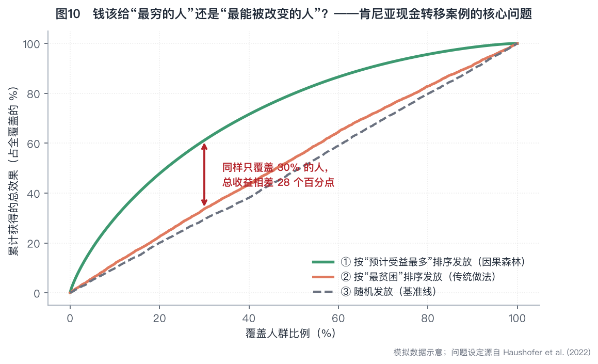

> ⚠️ 示意图（模拟数据），用于展示"定向策略差异"的机制；问题设定源自 Haushofer et al. (2022)。

**注意这里有一个价值判断问题**：论文陈述的是"效率"意义上的结论（总影响最大化）。但"给最穷的人"背后是**公平**诉求，"给最能被改变的人"背后是**效率**诉求，二者未必一致。因果 ML 能告诉你效率前沿在哪，但**不能替你决定要不要走上去**。论文在后面讨论"公平性"时也呼应了这一点。

### 表7　论文四个实证案例汇总

| 案例 | 数据/背景 | 用的方法 | 核心发现 |
|---|---|---|---|
| 明瑟工资方程 | 劳动经济学经典模型 | Double ML | 自动纳入相关的非线性与交互项，避免过拟合 |
| 定居者死亡率 | 64 个国家；AJR (2001) | Double ML + Lasso（IV 情境） | 结论与原研究一致，但**置信区间更窄** |
| Jobs First 福利实验 | 美国康涅狄格州 | 因果森林 | 发现远多于传统方法的异质性，**支持了劳动供给理论** |
| 肯尼亚现金转移 | 肯尼亚反贫困项目 | 因果森林 | **按受益定向优于按贫困定向** |

---

## 八、四条红线：论文最想让你记住的警告

综述的后半部分几乎全是"泼冷水"，而这恰恰是最有价值的部分。

### 8.1 红线一：黑箱与不稳定——预测很稳，但模型结构不稳

论文引用 Mullainathan & Spiess（2017）的房价预测研究：把一份大型房产数据随机切成 **10 个子样本**，分别跑 Lasso。

按理说随机切分，结果应该差不多。但实际上：
- **Lasso 在每个子样本里选出的变量都不一样**——"房间数"在有些模型里进了、有些没进；"建筑面积"的重要性忽高忽低；
- **然而预测出来的房价高度相关**——预测能力非常稳定。

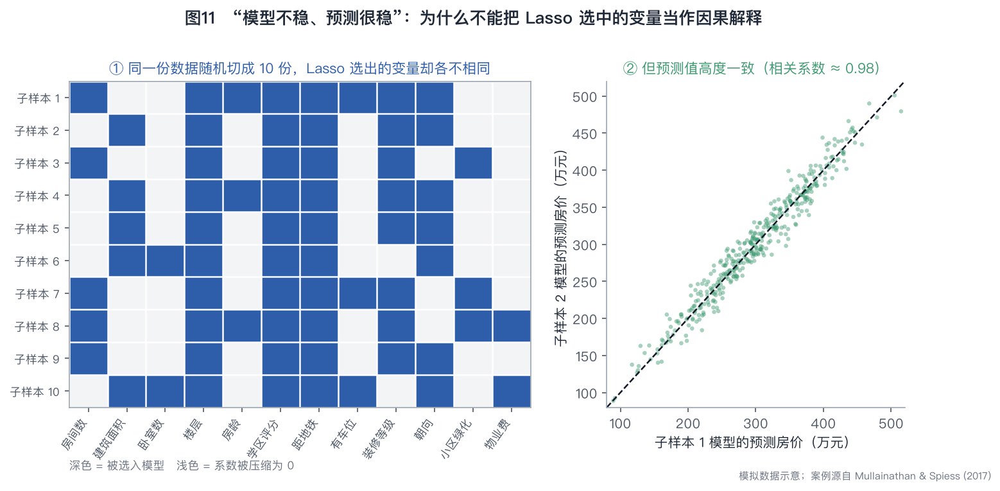

**为什么会这样？** 因为"房间数"和"建筑面积"高度相关、可以互相替代。Lasso 在两个几乎等价的变量之间是**任意挑一个**的，挑哪个取决于这批样本的随机波动，而不是变量的真实重要性。

**这个结论的杀伤力**：
- 你**不能**把 Lasso 选中的变量当成"重要的因果因素"来解读；
- 在政策场合过度解读模型结构，会得出误导性结论；
- 对**可复制性**的含义是：预测值可以复制，**模型结构却未必能复制**。

论文也提到，特征重要性（feature importance）、部分依赖图（partial dependence plot）这些可解释性工具有帮助，但**只提供近似的、描述性的**洞察，必须谨慎使用。提高因果 ML 的透明度仍然是一个**尚未解决的重要研究方向**。

### 8.2 红线二：遗漏变量偏误——机器学习救不了你

这条最简单，也最容易被忘记：

> **Double ML 不能替代一个站得住脚的识别策略。**

条件独立性假设要求**所有相关的混杂变量都被观测到**。如果"能力"这个变量你根本就没测，那么无论用 OLS 还是用最先进的 Double ML，教育回报都会被高估——因为估计值里混着能力的间接效应。

机器学习擅长的是"**在你观测到的几百个变量里挑对**"，不是"**替你观测到没测的变量**"。

### 8.3 红线三：对撞偏误——而且 Double ML 特别危险

这是论文里技术含量最高、也最值得警惕的一条。

**对撞变量（collider）**是那些**同时被处理和结果影响**的变量。控制它不但没好处，反而会**凭空制造出偏误**。

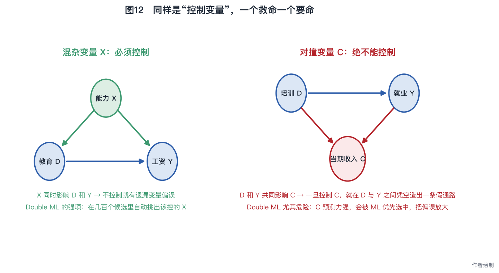

论文的例子：估计**职业培训对就业**的影响时，如果控制了**当期收入**——培训通过提升技能影响收入，就业状态也影响收入，收入就是一个对撞变量。控制它之后，"没参加培训但收入很高的人"（可能靠资历或行业景气）会显得更容易就业，从而扭曲培训的估计效应。

**关键洞察在这里**：

> **Double ML 比传统方法更容易被对撞变量伤害。**

原因很直白：Double ML 的第①②步是**用监督学习做预测**，而对撞变量恰恰是**预测力极强的变量**（它被处理和结果同时决定，当然预测力强）。机器学习会优先选中它、给它很大权重，于是对撞偏误被**放大**了。

相比之下，传统计量方法不以预测为目标，对撞变量只是众多控制变量之一，权重不会因为"预测力强"而被抬高，偏误相对较弱。

### 8.4 案例：PSID 性别工资差距——一个变量就够了

论文引用 Hünermund、Louw、Caspi（2023）：用 PSID 数据估计性别工资差距时，在 **50 个控制变量**的基础上，仅仅多放进**一个**变量——**婚姻状态**（相对于女性劳动力供给决策而言可能是内生的）——

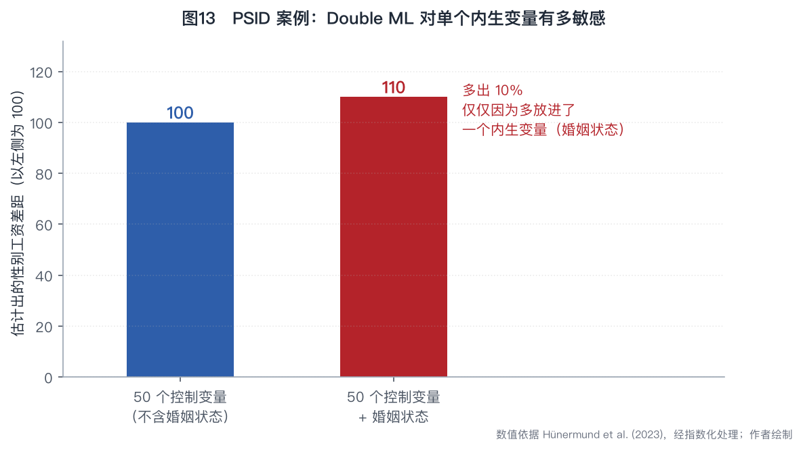

结果：估计出的工资差距**大了 10%**。而且 Lasso 在预测工资时**每次都会把婚姻状态选进模型**——正因为它预测力强。

> **一个变量，10% 的偏差。** 这就是"变量选择不能全交给算法"的最好证明。

### 表8　三类偏误对照

| 偏误类型 | 什么时候发生 | 因果 ML 能解决吗 | 怎么防 |
|---|---|---|---|
| **遗漏变量偏误** | 影响 D 和 Y 的变量没被观测到 | ❌ 完全不能 | 靠数据收集、靠识别策略（IV/DiD/RDD）、靠敏感性分析 |
| **对撞偏误** | 控制了被 D 和 Y 共同影响的变量 | ❌ 反而更严重 | 画因果图（DAG）；把"结果之后才发生的变量"全部排除 |
| **过拟合导致的方差膨胀** | 控制变量太多、样本太小 | ✅ 这是它的主场 | 交叉验证 + 交叉拟合 |

### 8.5 红线四：数据量、算力与公平性

**数据量**：估计异质性效应需要**大样本**。因为分析是"拆细"的，标准误天然更大——当异质性本身比较温和时，很可能什么都测不显著。这直接限制了因果森林在小样本场景的适用性。

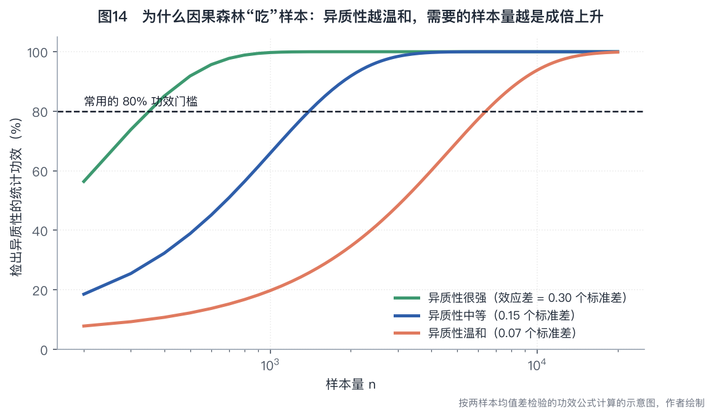

**算力**：论文的判断相对乐观——**大多数 ML 估计量的计算效率和传统方法相当**，现代统计软件已经把使用门槛降下来了。只有神经网络这类方法需要显著的算力和专门的编程能力。

**公平性（fairness）**：这是论文放在最后但特别强调的一点。算法可能因为数据或模型设计而产生**算法偏见**，对特定群体造成不成比例的伤害，从而损害政策建议的伦理正当性。用因果 ML 做政策设计时，必须确保模型**不会无意中强化既有的不平等**。

---

## 九、论文自陈的局限

论文很坦率地划定了自己的边界：

> 本文聚焦经济学中常用的 ML 方法——预测类的 Lasso 与随机森林，因果类的 Double ML 与因果森林。**这限制了本文的范围。** 其他可能同样有价值的技术，如**支持向量机**、**矩阵补全**（matrix completion）和**因果发现**（causal discovery），本文没有讨论。

对读者的实际含义：**这是一篇入门导览，不是方法百科。** 尤其是面板数据场景下非常重要的合成控制/矩阵补全一族方法完全没有覆盖。

---

## 十、政策建议与作者主旨

### 原文"作者主旨"（Author's main message）

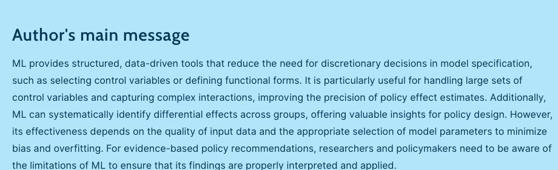

> **中文大意**：机器学习提供了结构化、数据驱动的工具，减少了模型设定中的自由裁量决策——比如选控制变量、定函数形式。它尤其适合处理大量控制变量、捕捉复杂交互，从而提高政策效应估计的精度；还能系统性识别群体间的效应差异，为政策设计提供有价值的洞察。但它的有效性取决于输入数据的质量和模型参数的恰当选择，以尽量减少偏误与过拟合。要给出循证的政策建议，研究者和政策制定者必须清楚 ML 的局限，才能正确解读和应用其结果。

### 论文"总结与政策建议"章节的要点

1. 因果 ML 通过处理复杂关系和海量控制变量，弥补了传统方法的部分局限，能给出**更细致的干预效果洞察**；
2. 已有的政策应用包括：**肯尼亚反贫困项目的异质性影响**、**福利政策对劳动供给的影响**；
3. 因果 ML 可以用来**评估和设计**面向多样人群的政策：通过识别异质性效应来**优化资源配置、定制干预措施**（现金转移、福利改革等），把政策影响最大化；
4. **但是**——透明度不足和潜在偏误这些局限，必须被认真对待，才能保证政策结论既准确又公平。

---

## 十一、给研究者的实操清单

以下内容为本文作者结合论文观点整理的操作性建议，供参考。

### 图15　我该用哪种方法？

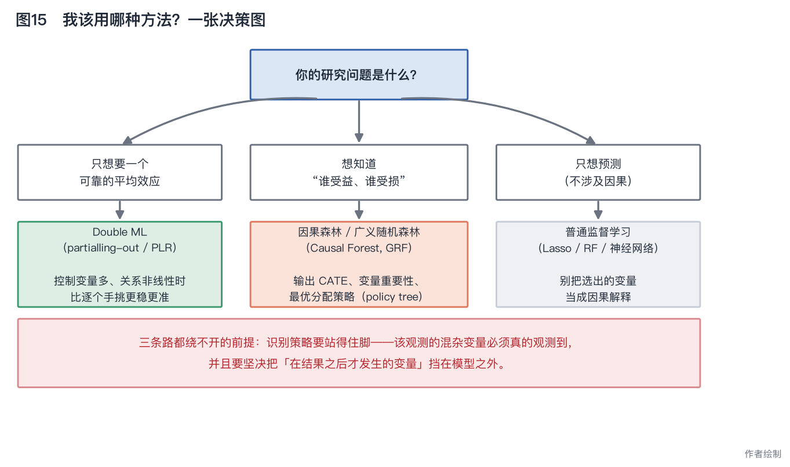

### 表9　方法与软件包对照

| 方法 | R | Python | Stata |
|---|---|---|---|
| Lasso / 后选择推断 | `hdm`、`glmnet` | `scikit-learn` | `lassopack`、`pdslasso` |
| Double ML | `DoubleML`、`hdm` | `DoubleML`、`EconML` | `ddml`（配合 `pystacked`） |
| 因果森林 / 广义随机森林 | `grf` | `EconML`、`causalml` | 原生支持较弱，一般通过 `ddml`/`pystacked` 调 Python 后端 |
| 最优分配策略（policy learning） | `policytree` | `EconML` | — |

> 说明：软件生态更新很快，上表为常见选择，非论文内容。

### 表10　动手前的检查清单

| # | 检查项 | 为什么 |
|---|---|---|
| 1 | 先画一张因果图（DAG），把每个候选变量归类：混杂 / 中介 / 对撞 / 无关 | 防对撞偏误的**唯一**可靠办法，算法帮不了你 |
| 2 | 把所有"在处理之后才发生"的变量剔除出控制变量集 | 这是对撞变量和中介变量的高发区 |
| 3 | 确认识别策略本身成立（条件独立 / 有效工具 / 平行趋势） | ML 改善估计，不改善识别 |
| 4 | 一定要用交叉拟合（cross-fitting），并报告折数 | 否则标准误不可信 |
| 5 | 换随机种子、换折数、换 ML 学习器，看结果稳不稳 | 直接对应论文说的"模型不稳定" |
| 6 | 做异质性分析前先估算样本量是否够 | 避免"切太细，全不显著" |
| 7 | 报告 CATE 的**分布**，不只是几个分组均值 | 异质性分析的意义就在分布里 |
| 8 | 不要把 Lasso 选中的变量解读为"重要的因果因素" | 高度相关的变量之间是随机挑一个 |
| 9 | 做敏感性分析（如对未观测混杂的稳健性） | 遗漏变量偏误没法靠算法解决 |
| 10 | 如果结果要用于定向分配，明确说清"效率 vs 公平"的取舍 | 论文强调的伦理与公平性维度 |

### 表11　术语中英对照

| 中文 | English | 一句话解释 |
|---|---|---|
| 过拟合 | Overfitting | 模型学到了噪声而不是规律 |
| 交叉验证 | Cross-validation | 切成 k 份轮流当考卷，用来调参 |
| 交叉拟合 | Cross-fitting | Double ML 里防止 ML 过拟合渗透进因果估计的分折技术 |
| 偏差—方差权衡 | Bias–variance trade-off | 太简单会偏，太复杂会飘 |
| 监督学习 | Supervised ML | 输入输出都可见，学预测规则 |
| 双重机器学习 | Double ML | 两次预测 + 取残差 + 残差回归 |
| 条件平均处理效应 | CATE | 给定个体特征 x 下的处理效应 τ(x) |
| 因果森林 | Causal Forest | 以"效应差最大"为分裂准则的随机森林 |
| 混杂变量 | Confounder | 同时影响处理和结果，必须控制 |
| 对撞变量 | Collider | 同时被处理和结果影响，绝不能控制 |
| 遗漏变量偏误 | Omitted variable bias | 没观测到关键混杂变量导致的偏误 |
| 无穷小 Jackknife | Infinitesimal Jackknife | 因果森林算标准误的重抽样方法 |

---

## 十二、常见误解 Q&A

**Q1：用了机器学习，是不是就不用担心内生性了？**
不是，而且恰恰相反。论文的核心警告之一就是：Double ML **完全不能**解决遗漏变量偏误，还比传统方法**更容易**被对撞偏误伤害。识别问题依然是识别问题。

**Q2：模型预测得准，是不是说明它抓到了真实机制？**
不是。房价案例说明得很清楚：10 个子样本选出 10 套不同的变量，但预测值高度一致。预测准确性和结构正确性是**两回事**。

**Q3：因果森林是不是只能"探索"，不能做正式推断？**
可以做正式推断。论文明确指出因果森林是**一致且渐近正态**的，标准误可以用无穷小 Jackknife 估计。真正的约束是**样本量**，不是理论性质。

**Q4：控制变量是不是放得越多越好？让算法自己筛就行？**
不行。这是论文最强的实证警告：PSID 案例里多放**一个**婚姻状态，性别工资差距就大了 **10%**。哪些变量可以进入候选池，必须由**因果推理**决定，不能交给算法。

**Q5：因果 ML 会不会让传统计量方法过时？**
论文的定位很清楚，用的词是 **complements（补充）**而不是 replaces。IV、DiD、RDD 这些设计解决的是**识别**问题；因果 ML 改善的是这些设计内部的**估计**环节——比如 IV 需要控制哪些工具混杂因子、DiD 的条件平行趋势需要控制什么。二者是叠加关系，不是替代关系。

**Q6：小样本能用吗？**
平均效应（Double ML）在小样本上反而可能受益——论文明确说"especially in small samples"，因为它避免了控制变量过多导致的方差膨胀（定居者死亡率案例只有 64 个国家）。但**异质性分析（因果森林）需要大样本**，这是硬约束。

---

## 十三、参考文献

### 论文的关键参考文献（Key references，编号同原文）

| 编号 | 文献 |
|---|---|
| [1] | Belloni, A., Chen, D., Chernozhukov, V., and Hansen, C. "Sparse models and methods for optimal instruments with an application to eminent domain." *Econometrica* 80:6 (2012): 2369–2429. |
| [2] | Chernozhukov, V., Chetverikov, D., Demirer, M., Duflo, E., Hansen, C., Newey, W., and Robins, J. "Double/debiased machine learning for treatment and structural parameters." *Econometrics Journal* 21:1 (2018): C1–C68. |
| [3] | Acemoglu, D., Johnson, S., and Robinson, J. A. "The colonial origins of comparative development: An empirical investigation." *American Economic Review* 91:5 (2001): 1369–1401. |
| [4] | Belloni, A., Chernozhukov, V., and Hansen, C. "High-dimensional methods and inference on structural and treatment effects." *Journal of Economic Perspectives* 28:2 (2014): 29–50. |
| [5] | Knaus, M. C., Lechner, M., and Strittmatter, A. "Heterogeneous employment effects of job search programs: A machine learning approach." *Journal of Human Resources* 57:2 (2022): 597–636. |
| [6] | Wager, S., and Athey, S. "Estimation and inference of heterogeneous treatment effects using random forests." *JASA* 113 (2018): 1228–1242. |
| [7] | Bitler, M., Gelbach, J. B., and Hoynes, H. W. "Can variation in subgroups' average treatment effects explain treatment effect heterogeneity? Evidence from a social experiment." *Review of Economics and Statistics* 99:4 (2017): 683–697. |
| [8] | Strittmatter, A. "What is the value added by using causal machine learning methods in a welfare experiment evaluation?" *Labour Economics* 84 (2023): 102412. |
| [9] | Haushofer, J., Niehaus, P., Paramo, C., Miguel, E., and Walker, M. W. *Targeting impact versus deprivation.* NBER Working Paper 30138, 2022. |
| [10] | Mullainathan, S., and Spiess, J. "Machine learning: An applied econometric approach." *Journal of Economic Perspectives* 31:2 (2017): 87–106. |
| [11] | Hünermund, P., Louw, B., and Caspi, I. "Double machine learning and automated confounder selection – A cautionary tale." *Journal of Causal Inference* 11:1 (2023): 20220078. |
| [12] | Blau, F. D., and Kahn, L. M. "The gender wage gap: Extent, trends, and explanations." *Journal of Economic Literature* 55:3 (2017): 789–865. |

### 论文推荐的进一步阅读（Further reading）

- Chernozhukov, V., Hansen, C., Kallus, N., Spindler, M., and Syrgkanis, V. *Applied Causal Inference Powered by ML and AI*, 2024.
- Athey, S., and Imbens, G. W. "Machine Learning Methods Economists Should Know About." *Annual Review of Economics* 11 (2024): 685–725.
- James, G., Witten, D., Hastie, T., and Tibshirani, R. *An Introduction to Statistical Learning* (2nd ed.), Springer, 2023.

### 原文致谢与利益声明

- **致谢**：作者感谢一位匿名审稿人和 IZA World of Labor 编辑对早期草稿提出的诸多有益建议。
- **利益冲突声明**：作者声明遵守 IZA 研究诚信指导原则。
- **版权**：© Anthony Strittmatter

---

## 附：本文档的图表清单

| 编号 | 图名 | 来源 |
|---|---|---|
| 图0 | 使用 ML 因果方法的经济学论文数量趋势 | **原文配图**（IZA WoL） |
| — | Elevator pitch / Key findings / Author's main message | **原文网页截图** |
| 图1 | 因果机器学习知识地图 | 作者据论文内容整理绘制 |
| 图2 | 偏差—方差权衡 | 作者绘制（示意） |
| 图3 | 5 折交叉验证 | 作者绘制（示意） |
| 图4 | Lasso 系数收缩路径 | 作者绘制（模拟数据 n=400, p=8） |
| 图5 | 决策树 vs 因果树 | 作者绘制（示意） |
| 图6 | Double ML 四步流水线 | 作者据 Chernozhukov et al. (2018) 绘制 |
| 图7 | 残差化前后对比 | 作者绘制（模拟数据 n=500，真实效应=1.0） |
| 图8 | 定居者死亡率案例三种做法对比 | 作者绘制（示意，数值为说明性构造） |
| 图9 | CATE 分布 vs 传统分组 | 作者绘制（模拟数据） |
| 图10 | 按受益定向 vs 按贫困定向 | 作者绘制（模拟数据） |
| 图11 | Lasso 模型不稳定但预测稳定 | 作者绘制（模拟数据；案例源自 Mullainathan & Spiess, 2017） |
| 图12 | 混杂变量 vs 对撞变量 DAG | 作者绘制 |
| 图13 | PSID 性别工资差距 ±婚姻状态 | 作者绘制（数值依据 Hünermund et al., 2023，经指数化） |
| 图14 | 样本量与异质性检验功效 | 作者绘制（功效公式计算） |
| 图15 | 方法选择决策图 | 作者绘制 |

所有作者绘制的图表由 [scripts/make_figures.py](scripts/make_figures.py) 生成，可直接复现：

```bash
pip install matplotlib numpy
python scripts/make_figures.py
```
