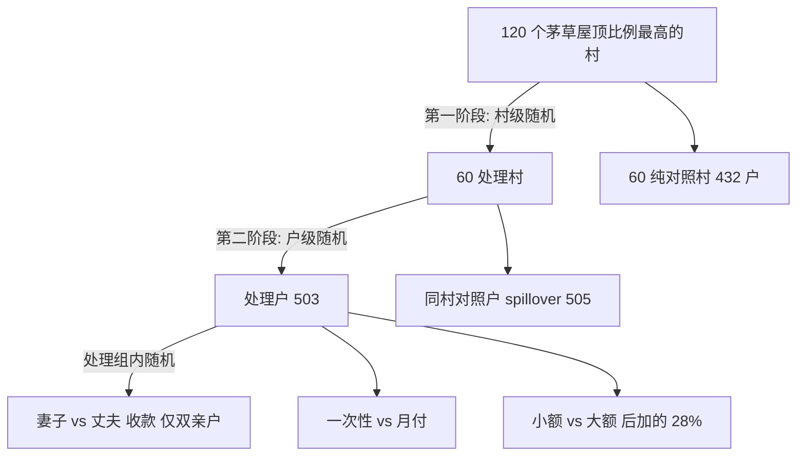

# 无条件现金转移的短期影响：肯尼亚实验证据（QJE 2016）

> [!summary] 一句话
> GiveDirectly 在肯尼亚 Rarieda 给茅草屋顶的贫困户发放**无条件、大额、集中**的现金（USD 404 或 1,525 PPP），
> 两级随机化实验显示：约 9 个月后受助户**资产 +USD 302（+61%）**、**非耐用品消费 +USD 36（+23%）**、
> **食品安全 +0.26 SD**、**心理福祉 +0.26 SD**，但健康、教育、企业利润无显著变化；月付比一次性支付更改善食品安全，
> 一次性支付更多转为耐用品（铁皮屋顶）——暗示储蓄/信贷约束；村内溢出效应总体不显著。

## 1. 研究问题

- 无条件现金转移（UCT）对极贫农户的消费、资产、生产、食品安全、健康、教育、心理福祉与女性赋权有何短期影响？
- 转移**设计**是否重要：给妻子还是丈夫？一次性（lump-sum）还是 9 个月分期（monthly）？小额（USD 404）还是大额（USD 1,525）？
- 转移是否对**同村非受助户**产生溢出（经济或心理，如 John Henry 效应）？

## 2. 背景与数据

| 项目 | 内容 |
|---|---|
| 执行方 | NGO GiveDirectly（GD），通过 M-Pesa 手机支付，2011-06 至 2013-01 |
| 地点 | 肯尼亚 Rarieda 区，茅草屋顶比例最高的 120 个村（数据中 endline 村标识 123 个） |
| 资格 | 住茅草屋顶（贫困代理指标） |
| 样本 | 1,440 户：503 受助户 + 505 同村对照户（"spillover"）+ 432 纯对照村户；每户访问主男/主女两名受访者（数据 2,880 行） |
| 转移额 | 小额 KES 25,200 = USD 404 PPP（名义 USD 300）；大额 KES 95,200 = USD 1,525 PPP（名义 USD 1,000）；平均 USD 709 PPP |
| 调查 | 基线（2011，仅处理村）+ 终线（约 9 个月后；纯对照村 2012 首次调查）|
| 结果变量 | 8 个预注册指数（Anderson 2008 加权标准化）：非土地资产、非耐用品消费、企业总收入、食品安全、健康、教育、心理福祉（含唾液皮质醇）、女性赋权 |

## 3. 识别策略：两级随机化

- **主效应**用村内比较（处理户 vs 同村对照户），因纯对照村无基线；**溢出**用同村对照户 vs 纯对照村户。
- **推断**：主效应按户聚类（户是随机化单位）；溢出按村聚类。
- **多重检验**：8 个指数上计算 FWER 校正 p 值（作者 `stepdown.ado`：安慰剂处理重抽 10,000 次的 Westfall-Young 式逐步下降）；另用 SUR（`suest`）做联合 Wald 检验。
- **预注册**：有 pre-analysis plan；偏离之处列于 Table A.3。

## 4. 核心方程

**(1) 基线平衡（Table I）**
$$y_{vhiB}=\alpha_v+\beta_0+\beta_1T_{vh}+\varepsilon_{vhiB}$$

**(2) 主处理效应（ANCOVA，Table II 列 2、Tables IV–VI）**
$$y_{vhiE}=\alpha_v+\beta_0+\beta_1T_{vh}+\delta_1 y_{vhiB}+\delta_2 M_{vhiB}+\varepsilon_{vhiE}$$
$M$ 为基线缺失指示变量（基线缺失时 $y_{vhiB}$ 置 0，即数据中的 `*_full0`/`*_miss0`）。

**(3)–(5) 处理臂比较（Table II 列 3–5）**：以"女性收款×双亲户"为例
$$y_{vhiE}=\alpha_v+\beta_0+\beta_1 T^{F}_{vh}+\beta_2 T^{single}_{vh}+\beta_3 S_{vh}+\delta_1 y_{vhiB}+\delta_2M_{vhiB}+\varepsilon$$
省略组为"男性收款×双亲户"，$\beta_1$ = 女性相对男性的效应；月付比较只在小额户内进行（`treatXmonthlyXsmall` + `treatXlarge` 控制）；大额比较控制 `spillover`。

**(10) 溢出（Table III）**
$$y_{vhiE}=\beta_0+\beta_1S_{vh}+\varepsilon_{vhiE}$$
样本：非处理户；不能加村 FE（与 $S$ 共线），村聚类。由于铁皮屋顶升级户被排除出抽样框（样本选择），作者：(a) 仅比较仍住茅草屋顶的户（列 3–4）；(b) 把 5 户（心理指数 10 人）"因溢出而升级"的户视为缺失，做 **Lee (2009) 界**（列 7–8）与 **Horowitz-Manski 界**（以 5%/95% 分位数填补，列 9–10）。

## 5. 主要发现（逐表）

| 发现 | 数值 | 出处 |
|---|---|---|
| 基线平衡良好；仅企业收入处理户低 USD 33（p<0.1，FWER p=0.43） | 联合检验 p=0.64 | Table I 列 2 |
| 非土地资产 +USD 301.5（对照均值 494.8） | (27.3)，FWER p=0.00 | Table II / VI |
| 非耐用品消费 +USD 35.7（对照 157.6） | (5.9)，FWER p=0.00 | Table II / V |
| 企业收入 +USD 16.2，但利润 −0.2（不显著） | FWER p=0.03 | Table II / VI |
| 食品安全 +0.26 SD；心理福祉 +0.26 SD | 均 FWER p=0.00 | Table II |
| 健康、教育、女性赋权主效应不显著 | −0.03 / 0.08 / −0.01 | Table II |
| 消费增量主要是食物（+19.5）、社交（+2.4）、医疗（+2.6）、教育（+1.1）；**酒精烟草不增加** | −0.93 / −0.15 | Table V |
| 心理：抑郁 CES-D −1.16 分，压力 −0.26 SD，幸福 +0.16，生活满意度 +0.17；皮质醇总体无效应 | | Table IV |
| 女性收款：心理 +0.14、女性赋权 +0.17（常规 p<0.1，FWER 不显著）；皮质醇 −0.17 | | Table II 列 3 / IV |
| 月付 vs 一次性：食品安全 +0.26 SD，资产 −91.9，铁皮屋顶 −0.12 | | Table II 列 4 / VI |
| 大额 vs 小额：资产 +279，消费 +21，心理 +0.26 SD（FWER 0.01），女性赋权 +0.22 | | Table II 列 5 |
| 溢出总体不显著（联合 p=0.38）；唯一显著：女性赋权 +0.21 SD | Lee 界 [0.20, 0.28] | Table III |
| 事后 MDE：主效应资产 USD 76（15%）、指数 0.14–0.20 SD | | Table A.1 |
| 终线流失与处理无关；Lee 界下资产 [283, 302]、心理 [0.20, 0.30] | | OA §8 |

> [!note] 勘误（2017）
> 发表版 Table I–II 的 FWER p 只用 1,000 次重抽，改为 10,000 次后变动 ≤0.01；Table III 心理指数误用户×村权重，
> 去权重后溢出估计从 **0.11 降到 0.03**；Lee 界误删缺失结果观测，更正后点估计小幅变化。
> 本仓库的 Stata 重跑与 StatsPAI 复现都对应**更正后**的数字，且用加权版本复原了发表版的 0.11/0.10/0.11/0.10。

## 6. 复现结论（详见 `Results/comparison.md`）

- 原始 Stata 代码 37 个步骤全部 rc=0，重生成 183 张表、30 个图文件；主文 7 张表除蒙特卡洛单元格（FWER p ±0.01、Lee 界 bootstrap SE）外逐格一致。
- StatsPAI 逐格复现 Table I–VI、A.1、OA Lee 界与分位数回归：系数/SE/N/联合检验全部 ✅；FWER p 偏差 ≤0.03（随机数流不同）。

## 7. 现代方法再评估（2016 → 2026）

| 主题 | 论文做法 | 现代做法 / 本仓库扩展 | 评价 |
|---|---|---|---|
| 多重检验 | 作者自写置换 stepdown（FWER）+ SUR 联合检验 | Romano-Wolf（Clarke-Romano-Wolf 2020 `rwolf`）、Anderson (2008) sharpened FDR；预注册"家族"定义 | ✅ 当年领先。`sp.romano_wolf`（村内去均值，2000 次 cluster bootstrap）下资产/消费/食品安全 p_rw=0，收入 0.001，健康/教育 0.23——结论不变 |
| 随机化推断 | 无，依赖聚类渐近 | Young (2019 QJE) 主张报告 RI p 值 | 扩展：**村内重排处理状态**（真实设计）2,000 次，资产/消费/食品/心理 p_RI=0，收入 0.003，健康 0.58，教育 0.17 → 与渐近推断一致 |
| 溢出推断 | 村聚类 SE（123 簇） | wild cluster bootstrap、村级 RI | 扩展：女性赋权溢出 wild p=0.022、村级 RI p=0.014，其他仍不显著 → 结论稳健 |
| 样本选择（铁皮屋顶） | Lee 界 + H-M 界 | Lee 界紧化（协变量 tight）、Semenova (2023) 带协变量的 Lee 界 | ⚠️ 仅 5 户"流失"，界很窄；但"只抽茅草屋顶户"本身把溢出识别建立在单调性假设上 |
| 异质性 | 预设臂（性别/时点/金额） | 因果森林、GATES/BLP（Chernozhukov et al. 2018/2023） | 扩展 `sp.causal_forest`：消费效应按基线资产四分位 23→33→38→35 USD；心理效应 0.10→0.18→0.24→0.25 SD——较富裕户心理改善更大，值得预注册检验 |
| 分布效应 | sqreg（OA §14） | QTE / 分布回归 | 复现：资产效应集中在中位数附近（q=.6–.7 约 +500），收入效应在右尾（q=.9 +57） |
| 一般均衡 / 长期 | 仅 9 个月、村内溢出 | Egger et al. (2022, *Econometrica*) GE 实验：本地乘数大、价格效应小；作者后续长期追踪报告了对非受助户的负向溢出（工作论文） | ⚠️ 短期"无溢出"的结论不能外推到长期或 GE |
| 心理测量 | 自报量表 + 皮质醇 | 量表效度检验（OA §16 Cronbach α）；需求效应检验 | 皮质醇无平均效应，是对自报心理改善的有益"客观"交叉验证 |

## 8. 值得记住的细节

- **ANCOVA + 缺失指示**：基线缺失置 0 并加 `_miss0`，保证样本不因基线缺失而丢失——Stata 会自动剔除全为 0 的 `_miss0`，Python 复现需同样处理。
- **单位**：心理指数在个人层面（男女各一行），其余在户层面（只用女性受访者行，`maleres==0`），这决定了 N=940 vs 1474。
- **FWER 的随机性**：作者 ado 每次调用 `set seed 1073741823`，但 Stata 18 下重跑与发表值仍差 ±0.01（排序/随机流差异），说明勘误中"0.02→0.03"类变化本身在蒙特卡洛误差之内。
